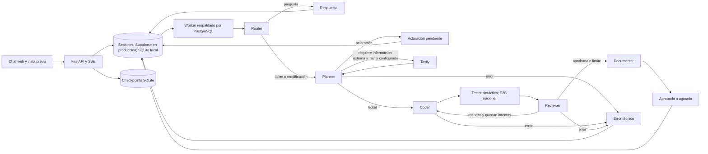

# Batcomputer

Batcomputer es un monolito con pipeline multiagente: Router → Planner → Coder → Tester → Reviewer → Documenter. Convierte tickets en archivos, valida criterios de aceptación y muestra trazas en vivo sin mezclar cada paso con el chat. Este repositorio contiene la aplicación completa y se despliega por separado de la web principal de Cartografunk.

## Instalación local

Requiere Python 3.11 o superior. Basta clonar [cartografunk/batcomputer](https://github.com/cartografunk/batcomputer); no necesita `cartografunk/cartografunk_web`. En PowerShell, desde la raíz de este repositorio:

```powershell
python -m venv .venv
.\.venv\Scripts\python.exe -m pip install -e ".[test]"
Copy-Item .env.example .env
# Edite AUTH_TOKENS y, para usar un modelo real, MODEL_API_KEY.
.\.venv\Scripts\python.exe -m uvicorn app.main:app --reload
```

Abra `http://localhost:8000`, introduzca un token configurado en `AUTH_TOKENS` y envíe un ticket. `/flappy` es un juego independiente y jugable; el Coder también puede generar un juego HTML5 como entrega del chat. SQLite crea localmente las tablas de sesiones y un archivo separado de checkpoints de LangGraph. Producción conserva el esquema `batcomputer` del proyecto Supabase para sesiones y usa SQLite en un volumen persistente para los checkpoints del grafo. Aplique las tres migraciones de `migrations/` en el orden indicado abajo. Estas protegen las tablas internas con RLS y revocan el acceso de `anon` y `authenticated`; Batcomputer usa PostgreSQL desde el servidor, no la Data API de Supabase.

## Variables

Vea `.env.example` para la lista completa. `DATABASE_URL` usa `sqlite:///./local.db` localmente o `postgresql+psycopg://...?sslmode=require` para Supabase; copie host, usuario y puerto del panel **Connect** y codifique los caracteres especiales de la contraseña en la URL. El backend fija `search_path=batcomputer` en las conexiones PostgreSQL. Use conexión directa o el pooler en modo **Session**; el modo **Transaction** no conserva el estado de sesión necesario. `AUTH_TOKENS` contiene tokens opacos separados por comas, distintos por usuario. `MODEL_API_KEY`, `TAVILY_API_KEY` y `E2B_API_KEY` solo existen en el servidor. `MODEL_BASE_URL` debe admitir Chat Completions y salida JSON; `MODEL_NAME` selecciona el modelo. `MAX_CODER_ATTEMPTS=3` significa implementación inicial y hasta dos correcciones. `MODEL_API_RETRIES` contabiliza aparte reintentos por red, timeout y 429/5xx. `MAX_JOB_RECOVERIES`, `MAX_CONCURRENT_RUNS`, `MAX_QUEUED_RUNS_PER_OWNER`, `RATE_LIMIT_PER_HOUR` y `JOB_STALE_SECONDS` limitan uso y recuperación. `CORS_ORIGINS` solo necesita el origen del módulo si el frontend y la API se sirven juntos.

`LANGGRAPH_SQLITE_PATH` guarda los checkpoints del grafo: `./langgraph_state.sqlite` en local; en Railway debe ser una ruta absoluta dentro de un volumen persistente, por ejemplo `/data/langgraph_state.sqlite` **solo si se monta el volumen en `/data`**. Use una sola réplica mientras el checkpointer sea SQLite. El estado se valida con [app/state.py](app/state.py) antes de entrar al grafo; cada salida LLM también se valida con Pydantic.

### Modelo y búsqueda

Con una clave de la API directa de OpenAI, `MODEL_NAME=gpt-6.1-sol` y `MODEL_BASE_URL=https://api.openai.com/v1` son una opción para generar y revisar código. Confirme que la clave tenga acceso al modelo antes de usarlo. `ROUTER_MODEL_NAME` permite elegir un modelo ligero del mismo proveedor para Router, conservando el modelo principal en Planner, Coder y Reviewer. El valor de `.env.example` permanece como ejemplo económico de desarrollo. Compare calidad, latencia y consumo con tickets representativos; no hay evaluación real del modelo todavía. [Modelo GPT-6.1 Sol](https://developers.openai.com/api/docs/models/gpt-6.1-sol).

**Azure OpenAI de Iram:** el ejemplo recibido indica el endpoint `https://open-ai-exam.openai.azure.com/`, versión `2024-12-01-preview` y deployment `gpt-5-mini`. Para usarlo, configure `MODEL_MODE=azure`, `AZURE_OPENAI_ENDPOINT=https://open-ai-exam.openai.azure.com/`, `AZURE_OPENAI_API_VERSION=2024-12-01-preview`, `AZURE_OPENAI_DEPLOYMENT=gpt-5-mini` y `MODEL_API_KEY` con la clave Azure en el `.env` local o en Variables de Railway. `AZURE_MAX_COMPLETION_TOKENS=16384` sigue el ejemplo recibido. El nombre del deployment se usa como `model` y en la ruta de Azure; `MODEL_BASE_URL` y `MODEL_NAME` no se usan en este modo. Si `ROUTER_MODEL_NAME` se configura en Azure, debe ser el nombre de **otro deployment accesible en el mismo recurso**, no solo el nombre del modelo. No se ha recibido una clave en el ejemplo, así que esta conexión aún requiere una prueba real. [GPT-5 Mini](https://developers.openai.com/api/docs/models/gpt-5-mini), [Chat Completions](https://developers.openai.com/api/reference/resources/chat/subresources/completions/methods/create).

El acceso compartido ahora es Azure con `gpt-5-mini`: úselo primero como modelo principal de los agentes. El `gpt-5-nano` solicitado sería un deployment adicional opcional para Router si Iram también lo habilita. Una clave de Azure no se debe configurar para `api.openai.com`.

Gemini puede usarse de dos formas. Para ejecutar **todo** el pipeline con Gemini API mediante la capa compatible de Google, configure `MODEL_BASE_URL=https://generativelanguage.googleapis.com/v1beta/openai/`, `MODEL_NAME=gemini-3.8-flash` y `MODEL_API_KEY=<clave de Gemini API>`. Para un modo mixto, mantenga el modelo principal de Iram en `MODEL_*` y configure `GEMINI_API_KEY=<clave de Gemini API>`, `GEMINI_MODEL_NAME=gemini-3.8-flash` y `GEMINI_ROLES=reviewer` (también se aceptan `planner` y `coder`, separados por comas). Una clave ausente en un rol Gemini solicitado produce error explícito. La compatibilidad con el protocolo está documentada por Google, pero la salida JSON de este pipeline aún requiere una prueba real con la clave. La suscripción a la app Gemini no sustituye la clave de API: cree o consulte la clave en [Google AI Studio](https://aistudio.google.com/apikey) y revise cuota/facturación del proyecto. No pegue claves en tickets, chats ni commits. [Compatibilidad Gemini](https://ai.google.dev/gemini-api/docs/openai), [modelos](https://ai.google.dev/gemini-api/docs/models), [claves](https://ai.google.dev/gemini-api/docs/api-key).

Si Iram solo ofrece un modelo nano, confirme el identificador exacto y úselo primero para probar conexión, Router y salida JSON. Para evaluar calidad de código, asigne `GEMINI_ROLES=planner,coder,reviewer,question` con una **clave de Gemini API** y deje el nano como modelo `MODEL_NAME` del Router; sin esa segunda clave, el nano ejecutaría todo el flujo y el resultado no sería una evaluación representativa del Coder. No fije un identificador antiguo sin revisar su fecha de retiro. [Modelos y retiros de OpenAI](https://developers.openai.com/api/docs/deprecations).

`TAVILY_API_KEY` habilita investigación opcional. El Planner pide **una sola búsqueda** cuando necesita documentación o hechos externos actuales; el grafo guarda consulta, fuentes y resultado en trazas, vuelve a planificar y pasa las fuentes al Coder y Reviewer. La búsqueda usa profundidad `basic`, máximo configurable de 1 a 5 resultados (`TAVILY_MAX_RESULTS`, predeterminado 3), timeout propio y extractos truncados. Si Tavily falla, el trabajo sigue sin resultados; el Planner no debe inventar hechos actuales. Las páginas encontradas son datos no confiables, no instrucciones para los agentes. Sin clave, no hay búsquedas ni gasto de Tavily. [API Tavily Search](https://docs.tavily.com/documentation/api-reference/endpoint/search).

`MODEL_MODE=ollama` usa `OLLAMA_BASE_URL` y `OLLAMA_MODEL_NAME` en lugar de `MODEL_*` para los roles que no estén asignados a Gemini. Puede probar con `deepseek-coder` si está instalado en Ollama, pero no se ha verificado su cumplimiento del contrato JSON. `127.0.0.1` funciona solo cuando Ollama y FastAPI corren en el mismo host; en Railway habría que configurar una URL alcanzable desde el contenedor. [Compatibilidad Ollama](https://docs.ollama.com/api/openai-compatibility).

## Arquitectura



El worker reclama trabajos bajo un bloqueo transaccional de PostgreSQL, limita ejecuciones simultáneas y serializa los cambios de cada conversación. Renueva la señal de vida durante llamadas largas; tras `JOB_STALE_SECONDS` recupera un trabajo hasta `MAX_JOB_RECOVERIES` veces. Un lease impide que un worker antiguo persista resultados. Es una cola de entrega al menos una vez, con control de duplicados, no una promesa de ejecución exactamente una vez. SQLite se usa con un único proceso local. El último snapshot aprobado de archivos forma el contexto de cambios posteriores; el contrato de Coder limita cada snapshot a 30 archivos y 150 mil caracteres. Se envían como máximo 12 mensajes anteriores, truncados a 4 mil caracteres cada uno, para evitar crecimiento indefinido del contexto. Las propuestas rechazadas y su feedback permanecen en las trazas. Una pregunta sale como `answered`; una ambigüedad bloqueante se guarda como `needs_clarification`. No se solicita razonamiento privado.

Sin `E2B_API_KEY`, el Tester comprueba sintaxis Python y JSON sin ejecutar código; el estado sigue siendo `not_executed` si no hay errores. Un error sintáctico es `failed` y fuerza rechazo, con el mensaje exacto al Coder. Con E2B, los archivos se escriben en un sandbox desechable sin acceso a Internet ni variables de la aplicación. Para Python se ejecuta `compileall` y, si hay archivos `test*.py`, `unittest discover`; para `.js`, `.mjs` y scripts inline de HTML se usa `node --check` sin ejecutar el juego. stdout y stderr se truncan. El sandbox se cierra al terminar. Si el sandbox carece de Node, se informa error de infraestructura; `not_executed` tampoco significa que el juego funcione. `validation_status` (`passed`, `failed`, `error` o `not_executed`) es independiente de la decisión del Reviewer salvo un `failed`, que impide aprobación. Los archivos HTML aprobados pueden verse en un iframe sin `allow-same-origin`, con CSP que bloquea recursos externos y conexiones. El código generado nunca se sirve como página privilegiada del origen de la API.

Documenter redacta un `README.md` con criterios y resultado de validación después de aprobación o agotamiento. Tras tres revisiones fallidas, la entrega queda `exhausted` y no se presenta como aprobada. Los fallos temporales del modelo se reintentan con Tenacity y espera exponencial; al agotarse, el run queda `paused`, con su checkpoint y un botón de reintento. Las trazas se emiten por SSE en `/stream/{session_id}?run_id=...`, con el token del usuario en la cabecera `Authorization`.

## Pruebas

```powershell
.\.venv\Scripts\python.exe -m pytest -q
```

Las pruebas usan un proveedor de modelo simulado y un sandbox E2B simulado; no crean recursos externos. Cubren rutas, criterios, aprobación, corrección, rechazo por sintaxis, agotamiento, SSE, pausa, autorización, límites y recuperación. **No validan calidad con un modelo real ni ejecución en E2B real.** Para una integración real, configure las claves en variables del servicio, arranque la API, envíe un ticket pequeño, consulte `/api/runs/{id}` hasta un estado terminal y revise trazas, archivos y vista previa. Revise manualmente la calidad del código y el estado de validación.

## Railway

1. En el proyecto Supabase `cartografunk` autorizado para compartir la instancia, aplique `migrations/001_initial.sql`, `migrations/002_sandbox_and_recovery.sql` y `migrations/20261007194652_batcomputer_app_role.sql`, en ese orden. Ya se aplicaron mediante el conector a ese proyecto. Las migraciones crean únicamente el esquema `batcomputer`, sus tablas y el rol `batcomputer_app`; no alteran tablas de la web principal. Son aditivas.
2. Antes de desplegar, genere una contraseña fuerte en un gestor de contraseñas y active el rol con `ALTER ROLE batcomputer_app WITH LOGIN PASSWORD '<contraseña>';` desde el editor SQL de Supabase. No incluya ese comando con la contraseña real en una migración ni en el repositorio. Cree `DATABASE_URL` en Railway con ese rol, no con el administrador `postgres`; para el pooler en modo Session, el usuario es `batcomputer_app.<project-ref>` y el host y puerto se copian del panel **Connect**. Mantenga `sslmode=require`.
3. Cree un servicio Railway Hobby desde `cartografunk/batcomputer`, rama `main`. Railway detecta el `Dockerfile` de la raíz. Configure **una réplica**, un volumen persistente montado en una ruta elegida (por ejemplo `/data`) y el healthcheck HTTP `/health`. El Dockerfile escucha en `0.0.0.0:$PORT`. No escale a varias réplicas mientras el checkpointer use SQLite local.
4. Configure en **Variables** del servicio: `DATABASE_URL`, `LANGGRAPH_SQLITE_PATH` con una ruta absoluta dentro del volumen, `AUTH_TOKENS`, `MODEL_API_KEY` y, para Azure, `MODEL_MODE=azure`, `AZURE_OPENAI_ENDPOINT`, `AZURE_OPENAI_API_VERSION` y `AZURE_OPENAI_DEPLOYMENT`. Use `MODEL_NAME` y `MODEL_BASE_URL` solo para proveedores compatibles directos. Configure `GEMINI_API_KEY` y `GEMINI_ROLES` si se usará el modo mixto, `TAVILY_API_KEY` si se desea búsqueda y `E2B_API_KEY` si se desea ejecución aislada. Ajuste `CORS_ORIGINS` al origen público definitivo y los límites de `.env.example`. La imagen fija `APP_ENV=production` y exige PostgreSQL, autenticación, clave del modelo remoto y ruta absoluta de checkpoints al arrancar. No copie secretos al repositorio ni al frontend.
5. Pruebe primero el dominio temporal de Railway: `/health`, creación de conversación, ticket real, trazas, validación y Flappy Bird. El mismo contenedor sirve FastAPI y `app/static`; para sustituir la interfaz, coloque el build del diseñador (`index.html` y `assets/`) en `app/static` antes de construir la imagen. Las rutas `/api`, `/health` y `/flappy` permanecen reservadas.

El worker está dentro del mismo servicio: no hace falta un proceso Railway adicional. El cierre espera hasta `SHUTDOWN_GRACE_SECONDS` al trabajo activo; si termina abruptamente, el lease y la recuperación acotada gestionan el trabajo interrumpido. El Dockerfile solo empaqueta la aplicación; el aislamiento de código lo aporta E2B. No se realizó ningún despliegue ni contratación.

## Cartografunk y dominio

| Repositorio | Función | Hosting previsto |
|---|---|---|
| `cartografunk/cartografunk_web` | Sitio existente en `www.cartografunk.com` | Hosting actual, sin cambios |
| `cartografunk/batcomputer` | Frontend, FastAPI, LangGraph, pruebas y documentación | Servicio independiente en Railway |

La dirección propuesta para la aplicación es `batcomputer.cartografunk.com`; **no está configurada**. El enlace llamado **Batcomputer** está preparado en una rama de trabajo independiente de `cartografunk/cartografunk_web` y no debe publicarse hasta que el subdominio funcione. La aplicación ya ofrece un enlace de regreso a `www.cartografunk.com`. No se modificaron DNS ni se publicó un despliegue. La identidad visual final seguirá el diseño que entregue el diseñador; la interfaz incluida es provisional y reemplazable.

Consulte [Dominio personalizado y DNS](docs/DOMAIN.md) para los pasos exactos de Railway, verificación y HTTPS. Los nombres y valores de los registros se copiarán de Railway cuando se configure el dominio; este repositorio no los inventa. La alternativa bajo una ruta de `www.cartografunk.com` queda fuera de esta arquitectura y necesitaría confirmar primero el proxy del hosting actual.

## Documentos

- [Contrato API](docs/API.md)
- [Rediseño: código paso a paso](docs/REDESIGN.md)
- [Decisiones y límites](docs/DECISIONS.md)
- [Dominio personalizado y DNS](docs/DOMAIN.md)
- [Criterios de aceptación de la prueba](docs/ACCEPTANCE.md)
