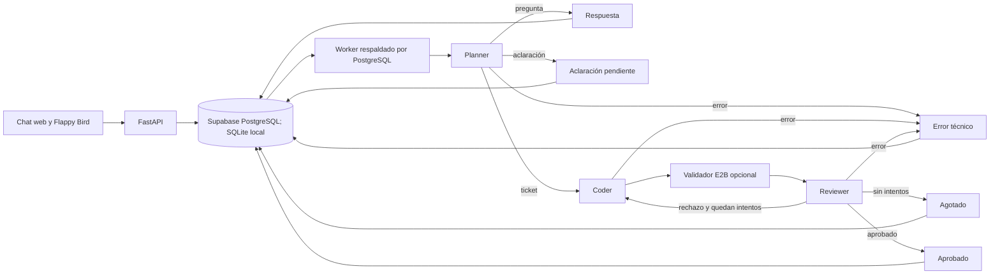

# Batcomputer

Batcomputer es un monolito con pipeline multiagente: convierte tickets en archivos mediante Planner, Coder, validación aislada y Reviewer. Cada turno persiste y muestra una respuesta final; trazas y archivos quedan separados. Este repositorio contiene la aplicación completa y se despliega por separado de la web principal de Cartografunk.

## Instalación local

Requiere Python 3.11 o superior. Basta clonar [cartografunk/batcomputer](https://github.com/cartografunk/batcomputer); no necesita `cartografunk/cartografunk_web`. En PowerShell, desde la raíz de este repositorio:

```powershell
python -m venv .venv
.\.venv\Scripts\python.exe -m pip install -e ".[test]"
Copy-Item .env.example .env
# Edite AUTH_TOKENS y, para usar un modelo real, MODEL_API_KEY.
.\.venv\Scripts\python.exe -m uvicorn app.main:app --reload
```

Abra `http://localhost:8000`, introduzca un token configurado en `AUTH_TOKENS` y envíe un ticket. `/flappy` es un juego independiente y jugable; su integración con el chat espera confirmación. SQLite sirve solo para desarrollo local y crea tablas automáticamente. Producción requiere Supabase/PostgreSQL y las migraciones `001_initial.sql` y `002_sandbox_and_recovery.sql`, en ese orden.

## Variables

Vea `.env.example` para la lista completa. `DATABASE_URL` usa `sqlite:///./local.db` localmente o `postgresql+psycopg://...` para Supabase. `AUTH_TOKENS` contiene tokens opacos separados por comas, distintos por usuario. `MODEL_API_KEY` y `E2B_API_KEY` solo existen en el servidor. `MODEL_BASE_URL` debe admitir Chat Completions y `response_format=json_object`; `MODEL_NAME` selecciona el modelo. `MAX_CODER_ATTEMPTS=3` significa implementación inicial y hasta dos correcciones. `MODEL_API_RETRIES` contabiliza aparte reintentos por red, timeout y 429/5xx. `MAX_JOB_RECOVERIES`, `MAX_CONCURRENT_RUNS`, `MAX_QUEUED_RUNS_PER_OWNER`, `RATE_LIMIT_PER_HOUR` y `JOB_STALE_SECONDS` limitan uso y recuperación. `CORS_ORIGINS` solo necesita el origen del módulo si el frontend y la API se sirven juntos.

## Arquitectura



El worker reclama trabajos bajo un bloqueo transaccional de PostgreSQL, limita ejecuciones simultáneas y serializa los cambios de cada conversación. Renueva la señal de vida durante llamadas largas; tras `JOB_STALE_SECONDS` recupera un trabajo hasta `MAX_JOB_RECOVERIES` veces. Un lease impide que un worker antiguo persista resultados. Es una cola de entrega al menos una vez, con control de duplicados, no una promesa de ejecución exactamente una vez. SQLite se usa con un único proceso local. Los archivos aprobados previos forman el contexto de cambios posteriores; las propuestas rechazadas y su feedback permanecen en las trazas. Una pregunta sale como `answered`; una ambigüedad bloqueante se guarda como `needs_clarification`. No se solicita razonamiento privado.

Si `E2B_API_KEY` está configurada, las propuestas con Python se escriben en un sandbox desechable sin acceso a Internet ni variables de la aplicación. Se ejecuta `compileall` y, si hay archivos `test*.py`, `unittest discover`; stdout y stderr se truncan. El sandbox se cierra al terminar. Los proyectos sin Python quedan `not_executed` en esta primera versión; no se presenta una comprobación vacía como exitosa. `validation_status` (`passed`, `failed`, `error` o `not_executed`) es independiente de la decisión del Reviewer. Los archivos HTML aprobados pueden verse en un iframe sin `allow-same-origin`, con CSP que bloquea recursos externos y conexiones. El código generado nunca se sirve como página privilegiada del origen de la API.

## Pruebas

```powershell
.\.venv\Scripts\python.exe -m pytest -q
```

Las pruebas usan un proveedor de modelo simulado y un sandbox E2B simulado; no crean recursos externos. Cubren aprobación, corrección, agotamiento, fallos, seguimiento, aclaraciones, autorización, límites y recuperación. **No validan calidad con un modelo real ni ejecución en E2B real.** Para una integración real, configure las claves en variables del servicio, arranque la API, envíe un ticket pequeño, consulte `/api/runs/{id}` hasta un estado terminal y revise `/traces` y `/files`. Revise manualmente la calidad del código y el estado de validación.

## Railway

1. Cree una base Supabase/PostgreSQL propia para el módulo. Revise y aplique manualmente `migrations/001_initial.sql` y después `migrations/002_sandbox_and_recovery.sql` en esa base; no apuntar a un proyecto existente sin autorización específica. Las migraciones son aditivas.
2. Cree un servicio Railway Hobby desde `cartografunk/batcomputer`, rama `main`. Railway detecta el `Dockerfile` de la raíz. Configure una réplica y el healthcheck HTTP `/health` en Railway. El Dockerfile escucha en `0.0.0.0:$PORT`.
3. Configure en **Variables** del servicio: `DATABASE_URL`, `AUTH_TOKENS`, `MODEL_API_KEY`, `MODEL_NAME`, `MODEL_BASE_URL` si difiere del predeterminado y `E2B_API_KEY` si se desea ejecución aislada. Ajuste `CORS_ORIGINS` al origen público definitivo y los límites de `.env.example`. La imagen fija `APP_ENV=production` y exige PostgreSQL, autenticación y clave del modelo al arrancar. No copie secretos al repositorio ni al frontend.
4. Pruebe primero el dominio temporal de Railway: `/health`, creación de conversación, ticket real, trazas, validación y Flappy Bird. El mismo contenedor sirve FastAPI y `app/static`; para sustituir la interfaz, coloque el build del diseñador (`index.html` y `assets/`) en `app/static` antes de construir la imagen. Las rutas `/api`, `/health` y `/flappy` permanecen reservadas.

El worker está dentro del mismo servicio: no hace falta un proceso Railway adicional. Más réplicas aumentan consumo; el bloqueo de PostgreSQL y `MAX_CONCURRENT_RUNS` coordinan reclamos. El cierre espera hasta `SHUTDOWN_GRACE_SECONDS` al trabajo activo; si termina abruptamente, el lease y la recuperación acotada gestionan el trabajo interrumpido. El Dockerfile solo empaqueta la aplicación; el aislamiento de código lo aporta E2B. No se realizó ningún despliegue ni contratación.

## Cartografunk y dominio

| Repositorio | Función | Hosting previsto |
|---|---|---|
| `cartografunk/cartografunk_web` | Sitio existente en `www.cartografunk.com` | Hosting actual, sin cambios |
| `cartografunk/batcomputer` | Frontend, FastAPI, LangGraph, pruebas y documentación | Servicio independiente en Railway |

La dirección propuesta para la aplicación es `batcomputer.cartografunk.com`; **no está configurada**. El enlace llamado **Batcomputer** está preparado en una rama de trabajo independiente de `cartografunk/cartografunk_web` y no debe publicarse hasta que el subdominio funcione. La aplicación ya ofrece un enlace de regreso a `www.cartografunk.com`. No se modificaron DNS ni se publicó un despliegue. La identidad visual final seguirá el diseño que entregue el diseñador; la interfaz incluida es provisional y reemplazable.

Consulte [Dominio personalizado y DNS](docs/DOMAIN.md) para los pasos exactos de Railway, verificación y HTTPS. Los nombres y valores de los registros se copiarán de Railway cuando se configure el dominio; este repositorio no los inventa. La alternativa bajo una ruta de `www.cartografunk.com` queda fuera de esta arquitectura y necesitaría confirmar primero el proxy del hosting actual.

## Documentos

- [Contrato API](docs/API.md)
- [Decisiones y límites](docs/DECISIONS.md)
- [Dominio personalizado y DNS](docs/DOMAIN.md)
- [Criterios de aceptación de la prueba](docs/ACCEPTANCE.md)
