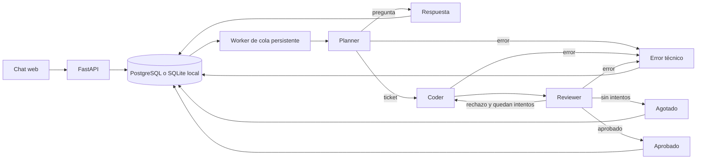

# Ticket to Code Agents

Un chat convierte tickets de programación en archivos mediante Planner, Coder y Reviewer. Cada turno queda persistido y el usuario recibe una respuesta final; los detalles de agentes se consultan por separado. El código generado se revisa estáticamente y se marca siempre como no ejecutado.

## Instalación local

Requiere Python 3.11 o superior. En PowerShell:

```powershell
python -m venv .venv
.\.venv\Scripts\python.exe -m pip install -e ".[test]"
Copy-Item .env.example .env
# Edite AUTH_TOKENS y, para usar un modelo real, MODEL_API_KEY.
.\.venv\Scripts\python.exe -m uvicorn app.main:app --reload
```

Abra `http://localhost:8000`, introduzca un token configurado en `AUTH_TOKENS` y envíe un ticket. La página `/flappy` es independiente; su integración con el chat espera confirmación. SQLite sirve para desarrollo local y crea tablas automáticamente. Para producción, use PostgreSQL y ejecute `migrations/001_initial.sql` antes de iniciar.

## Variables

Vea `.env.example`. `DATABASE_URL` admite `sqlite:///./local.db` o una URL `postgresql+psycopg://...` de Supabase/PostgreSQL. `AUTH_TOKENS` contiene tokens de acceso separados por comas; use tokens largos distintos por usuario y no los incluya en el repositorio. `MODEL_API_KEY` queda exclusivamente en el servidor. `MODEL_BASE_URL` debe ser compatible con Chat Completions y `response_format=json_object`; `MODEL_NAME` selecciona el modelo. `MAX_CODER_ATTEMPTS=3` significa implementación inicial y dos correcciones. `MODEL_API_RETRIES` cuenta los reintentos de red/429/5xx por llamada, independientes de las correcciones. `MODEL_TIMEOUT_SECONDS`, `JOB_STALE_SECONDS`, `WORKER_POLL_SECONDS`, `RATE_LIMIT_PER_HOUR` y `CORS_ORIGINS` ajustan los límites operativos.

## Arquitectura



El worker lee trabajos `queued`, los marca `running` en PostgreSQL bajo un bloqueo de conversación y recupera `running` cuya última señal supere `JOB_STALE_SECONDS`. Un solo worker es el modo local con SQLite. Los archivos aprobados previos forman el contexto de cambios posteriores. Una pregunta puede salir de Planner como `answered` sin invocar Coder. Se guarda cada salida y versión de archivo, incluidos los intentos rechazados. No se solicita razonamiento privado.

## Pruebas

```powershell
.\.venv\Scripts\python.exe -m pytest -q
```

Las pruebas usan un proveedor simulado. Cubren aprobación, corrección, agotamiento, fallos, seguimiento, preguntas, separación de acceso y recuperación. **No validan calidad con un modelo real.** Para una prueba real, configure `MODEL_API_KEY` y `MODEL_NAME`, arranque la API, envíe un ticket pequeño, consulte `/api/runs/{id}` hasta el estado final y revise `/traces` y `/files`. Compruebe manualmente la calidad de los archivos; no los ejecute en este servidor.

## Railway

1. Cree una base Supabase/PostgreSQL y aplique `migrations/001_initial.sql`.
2. Cree un servicio Railway desde este repositorio con el Dockerfile.
3. Configure `DATABASE_URL`, `AUTH_TOKENS`, `MODEL_API_KEY`, `MODEL_NAME`, `CORS_ORIGINS` y los límites deseados como variables privadas. Railway suministra `PORT`.
4. Configure una sola réplica inicialmente y pruebe un ticket real antes de aumentar capacidad. El worker va en el mismo contenedor y usa la base como cola.

El Dockerfile empaqueta el servicio; **no aísla código generado**. No se despliega ni contrata ningún servicio en este entregable.

## Documentos

- [Contrato API](docs/API.md)
- [Decisiones y límites](docs/DECISIONS.md)
