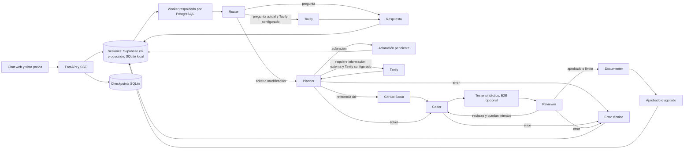

# Batcomputer

Batcomputer recibe un ticket de desarrollo y muestra cómo varios agentes lo convierten en una entrega de código. Puedes seguir sus decisiones, revisar los archivos y, cuando corresponde, abrir una vista previa. La aplicación vive en un repositorio y servicio propios, independientes de la web principal de Cartografunk.

## Instalación local

Requiere Python 3.11 o superior. Basta clonar [cartografunk/batcomputer](https://github.com/cartografunk/batcomputer); no necesita `cartografunk/cartografunk_web`. En PowerShell, desde la raíz de este repositorio:

```powershell
python -m venv .venv
.\.venv\Scripts\python.exe -m pip install -e ".[test]"
Copy-Item .env.example .env
# Edite AUTH_TOKENS (secreto del servidor) y, para usar un modelo real, MODEL_API_KEY.
.\.venv\Scripts\python.exe -m uvicorn app.main:app --reload
```

Abra `http://localhost:8000` y envíe un ticket. El modo local `AUTH_MODE=legacy` conserva la cookie anónima para desarrollo. En producción, `AUTH_MODE=supabase` muestra el login y la entrada limitada de invitado. `/flappy` es una implementación independiente del entregable 5 del enunciado, hecha para el repositorio; **no es una salida del pipeline ni demuestra que Coder pueda generar el juego**. Para probar esa capacidad, solicite el juego mediante el chat y revise los archivos, trazas y vista previa del run; el escenario `S7-flappy` de `python -m evals` mide ese caso por separado. SQLite crea localmente las tablas de sesiones y un archivo separado de checkpoints de LangGraph. Producción conserva el esquema `batcomputer` del proyecto Supabase para sesiones y usa SQLite en un volumen persistente para los checkpoints del grafo. Aplique las tres migraciones de `migrations/` en el orden indicado abajo. Estas protegen las tablas internas con RLS y revocan el acceso de `anon` y `authenticated`; Batcomputer usa PostgreSQL desde el servidor, no la Data API de Supabase.

## Variables

Vea `.env.example` para la lista completa. `DATABASE_URL` usa `sqlite:///./local.db` localmente o `postgresql+psycopg://...?sslmode=require` para Supabase; copie host, usuario y puerto del panel **Connect** y codifique los caracteres especiales de la contraseña en la URL. El backend fija `search_path=batcomputer` en las conexiones PostgreSQL. Use conexión directa o el pooler en modo **Session**; el modo **Transaction** no conserva el estado de sesión necesario. `AUTH_TOKENS` permanece solo en el servidor y firma las cookies de sesión. Con `AUTH_MODE=supabase`, configure `SUPABASE_URL`, la clave **publishable** y `ALLOWED_USER_EMAILS`; el login consulta Supabase Auth desde FastAPI y emite una cookie HttpOnly de 12 horas. No coloque una clave `service_role` en el navegador ni en estas variables. Los invitados reciben una cookie de una hora, con límites de 3 trabajos por invitado y 10 trabajos compartidos por hora. Las cookies anónimas antiguas y los Bearer legados no autorizan la API en este modo. `MODEL_API_KEY`, `TAVILY_API_KEY` y `E2B_API_KEY` solo existen en el servidor. `MODEL_BASE_URL` debe admitir Chat Completions y salida JSON; `MODEL_NAME` selecciona el modelo. `MAX_CODER_ATTEMPTS=3` significa implementación inicial y hasta dos correcciones. `MODEL_API_RETRIES` contabiliza aparte reintentos por red, timeout y 429/5xx. `MAX_JOB_RECOVERIES`, `MAX_CONCURRENT_RUNS`, `MAX_QUEUED_RUNS_PER_OWNER`, `RATE_LIMIT_PER_HOUR`, `GLOBAL_RATE_LIMIT_PER_HOUR` y `JOB_STALE_SECONDS` limitan uso y recuperación. `CORS_ORIGINS` solo necesita el origen del módulo si el frontend y la API se sirven juntos.

`LANGGRAPH_SQLITE_PATH` guarda los checkpoints del grafo: `./langgraph_state.sqlite` en local; en Railway debe ser una ruta absoluta dentro de un volumen persistente, por ejemplo `/data/langgraph_state.sqlite` **solo si se monta el volumen en `/data`**. Use una sola réplica mientras el checkpointer sea SQLite. El estado se valida con [app/state.py](app/state.py) antes de entrar al grafo; cada salida LLM también se valida con Pydantic.

### Acceso con Supabase Auth

1. En **Authentication → Users → Add user → Create new user**, cree `cartografunk@gmail.com` e `iramjuarez98@hotmail.com` con **Auto confirm user**. Cada persona debe definir una contraseña distinta de al menos 8 caracteres y recibirla por un canal privado. **`admin` tiene 5 caracteres y no cumple el mínimo de esta aplicación.** No guarde contraseñas en el repositorio ni en Railway.
2. La opción **Send invitation** necesita configurar `https://batcomputer.cartografunk.com/` como Site URL y un SMTP propio para estos destinatarios. El servicio de correo integrado de Supabase solo envía a miembros del equipo del proyecto; estas dos direcciones no figuran allí. El formulario de aceptación de invitaciones ya está preparado en la aplicación para cuando se configure SMTP, pero el alta directa evita bloquear el acceso ahora. No modifique la Site URL compartida del proyecto solo para probar invitaciones.
3. En Railway configure `AUTH_MODE=supabase`, `SUPABASE_URL=https://<project-ref>.supabase.co`, `SUPABASE_PUBLISHABLE_KEY` (clave pública, nunca `service_role`) y `ALLOWED_USER_EMAILS=cartografunk@gmail.com,iramjuarez98@hotmail.com`. El frontend no ofrece registro libre: solo las direcciones de esta lista pueden iniciar sesión o aceptar invitación.
4. Abra una ventana privada: sin login, las rutas de conversaciones deben responder 401. Pruebe login y aislamiento entre los dos usuarios. El botón **Entrar como invitado** crea una sesión distinta de una hora, limitada a 3 trabajos por sesión y 10 trabajos compartidos por hora; el invitado no ve las conversaciones de los usuarios.

La verificación de la contraseña y la activación de invitaciones pasan por Supabase Auth. FastAPI mantiene una cookie de aplicación firmada y HttpOnly, válida 12 horas para usuarios definidos. Cerrar sesión borra esa cookie. Revocar una cuenta de Supabase no invalida inmediatamente una cookie ya emitida: para cerrar acceso antes de su vencimiento, elimine la dirección de `ALLOWED_USER_EMAILS` o rote `AUTH_TOKENS` (esto cerrará todas las sesiones). [Autenticación con contraseña](https://supabase.com/docs/guides/auth/passwords), [seguridad de contraseñas](https://supabase.com/docs/guides/auth/password-security).

Al volver a abrir la página, la interfaz recupera la última conversación de esa cuenta y sus archivos y trazas recientes. La API lista solo conversaciones propias; una sesión de invitado conserva su historial únicamente mientras dure su cookie.

### Modelo y búsqueda

Con una clave de la API directa de OpenAI, configure un `MODEL_NAME` al que tenga acceso la clave y `MODEL_BASE_URL=https://api.openai.com/v1`. `ROUTER_MODEL_NAME` permite elegir un modelo ligero del mismo proveedor para Router, conservando el modelo principal en Planner, Coder y Reviewer. El valor de `.env.example` es solo un ejemplo de desarrollo. La batería `python -m evals` permite comparar calidad, latencia y consumo; publique sus resultados cuando se ejecute contra los modelos de producción.

**Azure OpenAI:** configure `MODEL_MODE=azure_responses`, `AZURE_OPENAI_ENDPOINT`, `AZURE_OPENAI_API_VERSION`, `AZURE_OPENAI_DEPLOYMENT` y `MODEL_API_KEY` en Variables de Railway o en el `.env` local. `AZURE_MAX_COMPLETION_TOKENS=16384` limita la salida. El nombre del deployment se envía como `model`; `MODEL_BASE_URL` y `MODEL_NAME` no se usan en este modo. Si `ROUTER_MODEL_NAME` se configura en Azure, debe ser otro deployment accesible en el mismo recurso. El modo `MODEL_MODE=azure` conserva Chat Completions para compatibilidad. El backend LangChain usa salida estructurada estricta con Azure y validación local Pydantic. Se probaron consultas y tickets pequeños contra producción; la batería completa con el modelo real aún no tiene un reporte publicado. [Responses API](https://learn.microsoft.com/en-us/azure/ai-services/openai/how-to/responses), [salida estructurada](https://learn.microsoft.com/en-us/azure/ai-services/openai/how-to/structured-outputs).

El despliegue actual usa Azure con `gpt-5-mini`. Un deployment adicional de menor costo puede asignarse a Router mediante `ROUTER_MODEL_NAME`. Una clave de Azure no se debe configurar para `api.openai.com`.

Gemini puede usarse de dos formas. Para ejecutar **todo** el pipeline con Gemini API mediante la capa compatible de Google, configure `MODEL_BASE_URL=https://generativelanguage.googleapis.com/v1beta/openai/`, `MODEL_NAME=gemini-3.8-flash` y `MODEL_API_KEY=<clave de Gemini API>`. Para un modo mixto, mantenga el modelo principal de Iram en `MODEL_*` y configure `GEMINI_API_KEY=<clave de Gemini API>`, `GEMINI_MODEL_NAME=gemini-3.8-flash` y `GEMINI_ROLES=reviewer` (también se aceptan `planner` y `coder`, separados por comas). Una clave ausente en un rol Gemini solicitado produce error explícito. La compatibilidad con el protocolo está documentada por Google, pero la salida JSON de este pipeline aún requiere una prueba real con la clave. La suscripción a la app Gemini no sustituye la clave de API: cree o consulte la clave en [Google AI Studio](https://aistudio.google.com/apikey) y revise cuota/facturación del proyecto. No pegue claves en tickets, chats ni commits. [Compatibilidad Gemini](https://ai.google.dev/gemini-api/docs/openai), [modelos](https://ai.google.dev/gemini-api/docs/models), [claves](https://ai.google.dev/gemini-api/docs/api-key).

Si Iram solo ofrece un modelo nano, confirme el identificador exacto y úselo primero para probar conexión, Router y salida JSON. Para evaluar calidad de código, asigne `GEMINI_ROLES=planner,coder,reviewer,question` con una **clave de Gemini API** y deje el nano como modelo `MODEL_NAME` del Router; sin esa segunda clave, el nano ejecutaría todo el flujo y el resultado no sería una evaluación representativa del Coder. No fije un identificador antiguo sin revisar su fecha de retiro. [Modelos y retiros de OpenAI](https://developers.openai.com/api/docs/deprecations).

`TAVILY_API_KEY` habilita investigación opcional. El Planner pide **una sola búsqueda** cuando necesita documentación o hechos externos actuales; el grafo guarda consulta, fuentes y resultado en trazas, vuelve a planificar y pasa las fuentes al Coder y Reviewer. El Router también puede pedir una búsqueda para una pregunta sobre hechos actuales; Question recibe los resultados y la respuesta muestra las fuentes consultadas. La búsqueda usa profundidad `basic`, máximo configurable de 1 a 5 resultados (`TAVILY_MAX_RESULTS`, predeterminado 3), timeout propio y extractos truncados. Si Tavily falla, el trabajo sigue sin resultados; los agentes no deben inventar hechos actuales. Las páginas encontradas son datos no confiables, no instrucciones para los agentes. Sin clave, no hay búsquedas ni gasto de Tavily. [API Tavily Search](https://docs.tavily.com/documentation/api-reference/endpoint/search).

`SCOUT_ENABLED=true` permite que el Planner solicite una referencia de GitHub cuando ayuda a un ticket de código. Scout consulta repositorios públicos, acepta solo licencias `MIT`, `Apache-2.0`, `BSD-2-Clause` o `BSD-3-Clause`, lee hasta dos archivos pequeños y pasa extractos limitados al Coder y Reviewer. El Coder debe crear su propia implementación; el README de la entrega cita el repositorio y la licencia consultada. No se usa Scout para juegos cuya generación original forma parte de la prueba. Si GitHub limita o falla la búsqueda, el ticket continúa sin referencia. La licencia del repositorio se comprueba mediante metadatos de GitHub y se descartan archivos con una cabecera SPDX conflictiva; revise licencias de archivos antes de redistribuir código adaptado. [Búsqueda de repositorios](https://docs.github.com/en/rest/search/search#search-repositories), [contenido de repositorios](https://docs.github.com/en/rest/repos/contents#get-repository-content).

`MODEL_MODE=ollama` usa `OLLAMA_BASE_URL` y `OLLAMA_MODEL_NAME` en lugar de `MODEL_*` para los roles que no estén asignados a Gemini. Puede probar con `deepseek-coder` si está instalado en Ollama, pero no se ha verificado su cumplimiento del contrato JSON. `127.0.0.1` funciona solo cuando Ollama y FastAPI corren en el mismo host; en Railway habría que configurar una URL alcanzable desde el contenedor. [Compatibilidad Ollama](https://docs.ollama.com/api/openai-compatibility).

## Arquitectura



El worker reclama trabajos bajo un bloqueo transaccional de PostgreSQL, limita ejecuciones simultáneas y serializa los cambios de cada conversación. Renueva la señal de vida durante llamadas largas; tras `JOB_STALE_SECONDS` recupera un trabajo hasta `MAX_JOB_RECOVERIES` veces. Un lease impide que un worker antiguo persista resultados. Es una cola de entrega al menos una vez, con control de duplicados, no una promesa de ejecución exactamente una vez. SQLite se usa con un único proceso local. El último snapshot aprobado de archivos forma el contexto de cambios posteriores; el contrato de Coder limita cada snapshot a 30 archivos y 150 mil caracteres. Se envían como máximo 12 mensajes anteriores, truncados a 4 mil caracteres cada uno, para evitar crecimiento indefinido del contexto. Las propuestas rechazadas y su feedback permanecen en las trazas. Una pregunta sale como `answered`; una ambigüedad bloqueante se guarda como `needs_clarification`. No se solicita razonamiento privado.

Sin `E2B_API_KEY`, el Tester comprueba sintaxis Python y JSON sin ejecutar código; el estado sigue siendo `not_executed` si no hay errores. Un error sintáctico es `failed` y fuerza rechazo, con el mensaje exacto al Coder. Con E2B, los archivos se escriben en un sandbox desechable sin acceso a Internet ni variables de la aplicación. Para Python se ejecuta `compileall` y, si hay archivos `test*.py`, `unittest discover`; para `.js`, `.mjs` y scripts inline de HTML se usa `node --check` sin ejecutar el juego. stdout y stderr se truncan. El sandbox se cierra al terminar. Si el sandbox carece de Node, se informa error de infraestructura; `not_executed` tampoco significa que el juego funcione. `validation_status` (`passed`, `failed`, `error` o `not_executed`) es independiente de la decisión del Reviewer salvo un `failed`, que impide aprobación. Los archivos HTML aprobados pueden verse en un iframe sin `allow-same-origin`, con CSP que bloquea recursos externos y conexiones. El código generado nunca se sirve como página privilegiada del origen de la API.

Documenter redacta un `README.md` con criterios y resultado de validación después de aprobación o agotamiento. Tras tres revisiones fallidas, la entrega queda `exhausted` y no se presenta como aprobada. Los fallos temporales del modelo se reintentan con Tenacity y espera exponencial; al agotarse, el run queda `paused`, con su checkpoint y un botón de reintento. Las trazas se emiten por SSE en `/stream/{session_id}?run_id=...`, con el token del usuario en la cabecera `Authorization`.

## Pruebas

```powershell
.\.venv\Scripts\python.exe -m pytest -q
```

Las pruebas usan un proveedor de modelo simulado y un sandbox E2B simulado; no crean recursos externos. Cubren rutas, criterios, aprobación, corrección, rechazo por sintaxis, agotamiento, SSE, pausa, autorización, límites y recuperación. **No validan calidad con un modelo real ni ejecución en E2B real.** Para una integración real, configure las claves en variables del servicio, arranque la API, envíe un ticket pequeño, consulte `/api/runs/{id}` hasta un estado terminal y revise trazas, archivos y vista previa. Revise manualmente la calidad del código y el estado de validación.

## Evaluación con modelo real y trazas

`python -m evals` corre una batería de 12 escenarios (tickets, seguimiento, preguntas, límites, Flappy Bird, dos fallos inducidos y dos casos de Scout) con el modelo configurado, y reporta estado, ruta, uso del trabajo previo, Scout, atribución, intentos, validación, tokens, costo y un juez LLM opcional. Con `--langsmith` sube la batería como dataset y experimento. `MODEL_BACKEND=langchain` activa trazas por agente en LangSmith y modelos distintos por rol (`ROLE_MODELS`). Vea [Evaluación y trazas](docs/EVALS.md).

## Railway

1. En el proyecto Supabase `cartografunk` autorizado para compartir la instancia, aplique `migrations/001_initial.sql`, `migrations/002_sandbox_and_recovery.sql` y `migrations/20261007194652_batcomputer_app_role.sql`, en ese orden. Ya se aplicaron mediante el conector a ese proyecto. Las migraciones crean únicamente el esquema `batcomputer`, sus tablas y el rol `batcomputer_app`; no alteran tablas de la web principal. Son aditivas.
2. Antes de desplegar, genere una contraseña fuerte en un gestor de contraseñas y active el rol con `ALTER ROLE batcomputer_app WITH LOGIN PASSWORD '<contraseña>';` desde el editor SQL de Supabase. No incluya ese comando con la contraseña real en una migración ni en el repositorio. Cree `DATABASE_URL` en Railway con ese rol, no con el administrador `postgres`; para el pooler en modo Session, el usuario es `batcomputer_app.<project-ref>` y el host y puerto se copian del panel **Connect**. Mantenga `sslmode=require`.
3. Cree un servicio Railway Hobby desde `cartografunk/batcomputer`, rama `main`. Railway detecta el `Dockerfile` de la raíz. Configure **una réplica**, un volumen persistente montado en una ruta elegida (por ejemplo `/data`) y el healthcheck HTTP `/health`. El Dockerfile escucha en `0.0.0.0:$PORT`. No escale a varias réplicas mientras el checkpointer use SQLite local.
4. Configure en **Variables** del servicio: `DATABASE_URL`, `LANGGRAPH_SQLITE_PATH` con una ruta absoluta dentro del volumen, `AUTH_TOKENS`, `AUTH_MODE=supabase`, `SUPABASE_URL`, `SUPABASE_PUBLISHABLE_KEY`, `ALLOWED_USER_EMAILS`, `MODEL_API_KEY` y, para el endpoint recibido, `MODEL_MODE=azure_responses`, `AZURE_OPENAI_ENDPOINT`, `AZURE_OPENAI_API_VERSION` y `AZURE_OPENAI_DEPLOYMENT`. Use `MODEL_NAME` y `MODEL_BASE_URL` solo para proveedores compatibles directos. Configure `GEMINI_API_KEY` y `GEMINI_ROLES` si se usará el modo mixto, `TAVILY_API_KEY` si se desea búsqueda y `E2B_API_KEY` si se desea ejecución aislada. Ajuste `CORS_ORIGINS` al origen público definitivo y los límites de `.env.example`. La imagen fija `APP_ENV=production` y exige PostgreSQL, autenticación, clave del modelo remoto y ruta absoluta de checkpoints al arrancar. No copie secretos al repositorio ni al frontend.
5. Pruebe primero el dominio temporal de Railway: `/health`, creación de conversación, ticket real, trazas y validación. Pruebe `/flappy` por separado como juego implementado en el repositorio; no lo presente como resultado de los agentes. El mismo contenedor sirve FastAPI y `app/static`. La interfaz actual toma la paleta, tipografías y patrones visuales de `cartografunk_web` en `app/static/assets/batcomputer.css`, sin cargar CSS desde la web principal ni necesitar ese repositorio para instalarse. Para incorporar el diseño definitivo, actualice `app/static` conservando los controles y rutas `/api`, `/health` y `/flappy`.

El worker está dentro del mismo servicio: no hace falta un proceso Railway adicional. El cierre espera hasta `SHUTDOWN_GRACE_SECONDS` al trabajo activo; si termina abruptamente, el lease y la recuperación acotada gestionan el trabajo interrumpido. El Dockerfile solo empaqueta la aplicación; el aislamiento de código lo aporta E2B. La aplicación está desplegada en Railway con una réplica, healthcheck `/health`, volumen `/data` y sesiones en el esquema `batcomputer` de Supabase.

## Cartografunk y dominio

| Repositorio | Función | Hosting previsto |
|---|---|---|
| `cartografunk/cartografunk_web` | Sitio existente en `www.cartografunk.com` | Cloudflare Pages |
| `cartografunk/batcomputer` | Frontend, FastAPI, LangGraph, pruebas y documentación | Servicio independiente en Railway |

La aplicación está disponible en `https://batcomputer.cartografunk.com/`, mediante un dominio personalizado de Railway y registros DNS en Cloudflare. La aplicación ofrece un enlace de regreso a `www.cartografunk.com`. La identidad visual final seguirá el diseño que entregue el diseñador; la interfaz incluida es provisional y reemplazable.

Consulte [Dominio personalizado y DNS](docs/DOMAIN.md) para la configuración aplicada y las verificaciones. La alternativa bajo una ruta de `www.cartografunk.com` queda fuera de esta arquitectura y necesitaría confirmar primero el proxy del hosting actual.

## Documentos

- [Contrato API](docs/API.md)
- [Rediseño: código paso a paso](docs/REDESIGN.md)
- [Decisiones y límites](docs/DECISIONS.md)
- [Dominio personalizado y DNS](docs/DOMAIN.md)
- [Criterios de aceptación de la prueba](docs/ACCEPTANCE.md)
- [Evaluación y trazas](docs/EVALS.md)
